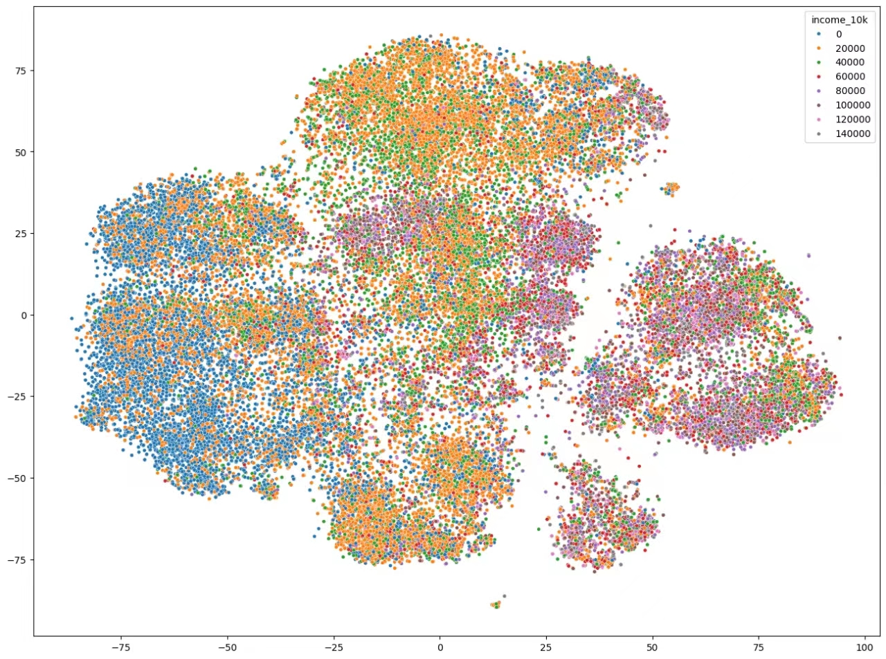
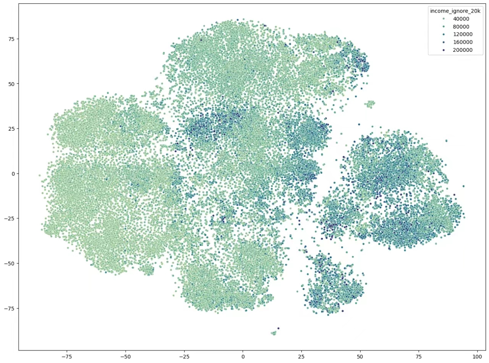

# Street View Images Can Tell You The GDP

**Group Members**: Wang Qian, Wan Ziyi, Gong Yantong

## Background

Our project aiming to predict GDP using Street View images operates on the premise that the visual characteristics of a neighborhood can be indicative of its economic status. This concept is based on several key observations:

1. **Infrastructure Quality:** Street images reveal the condition and modernity of infrastructure in an area. Wealthier regions typically showcase well-maintained roads, contemporary buildings, and sophisticated public spaces. This contrast becomes apparent when comparing the infrastructure of affluent areas with less prosperous ones.
2. **Commercial Activity:** The variety and nature of businesses present in an area can be directly correlated with its economic health. High-GDP areas are often bustling with a diverse array of businesses such as upscale shops, gourmet restaurants, and corporate offices. This diversity and the apparent level of investment in these establishments can be strong indicators of the local economic environment.
3. **Housing Conditions:** The size, design, and location of residences in street images can reflect the wealth of an area. Affluent neighborhoods often feature larger homes with attractive views and superior construction quality. The presence of well-maintained gardens, security features, and aesthetic enhancements also contribute to this assessment.
4. **Traffic and Transportation:** The types of vehicles and the condition of public transportation facilities visible in street images can hint at the area's economic standing. Luxury vehicles and well-kept public transport stations are commonly found in richer neighborhoods, implying a higher level of wealth and investment in public infrastructure.

The project seeks to analyze these visual cues from street images to predict the local GDP. By developing algorithms that can quantify these indicators from images, it's possible to estimate the economic status of a region. This approach could revolutionize economic analysis and planning, providing a novel way to assess and compare the economic health of different areas based on visual data alone. The project aims to refine these methods and explore the potential of visual data in economic forecasting and analysis.

## Data Sources Overview

The project utilizes two primary data sources: street view images and GDP data. These sources are integral to the methodology for predicting local GDP based on visual indicators.

### Street View Images

1. **Source Description:** The street view images are sourced from Kaggle's City Street View Dataset. This repository offers a comprehensive collection of Google Street View images.
2. **Dataset Characteristics:** The dataset encompasses images from five major U.S. cities: San Francisco, Detroit, Chicago, Washington, D.C., and New York City. It contains approximately 50,000 images, providing a diverse and extensive visual representation of different urban landscapes.

### GDP Data

1. **Data Provider:** The GDP data is acquired from the United States Census Bureau, known for its reliability and comprehensive economic data.
2. **Temporal Alignment:** Both the street view images and GDP data correspond to the year 2021, ensuring temporal consistency in the analysis.
3. **Measurement and Detail Level:** The GDP data is measured in U.S. dollars(2021). To achieve a granular understanding of economic conditions, the data focuses on per capita GDP at the block level.

## Image Data Processing

In our early attempts, we used CNN and VIT to learn directly from street view images, but the results were poor. To effectively analyze and utilize the Street View images, our project employs the CLIP Vit Large Patch14 model, a sophisticated tool in the realm of machine learning and image processing.

The CLIP Vit Large Patch14 model represents a fusion of two innovative technologies: the Vision Transformer (ViT) and Contrastive Language-Image Pre-training (CLIP). This model is unique in its ability to perform zero-shot image classification, a task that involves categorizing images into classes not seen during training. It leverages a substantial dataset comprising both images and text, allowing it to not only understand visual content but also to generate textual interpretations of images.

A crucial aspect of this model's implementation in the project is its dimensionality reduction capability. Each image from the Street View dataset is transformed into a 1×768 vector. This transformation is critical as it simplifies the complex visual data into a more manageable form without significant loss of information. By reducing the dimensionality of the images, the model facilitates more efficient and effective data processing and analysis.

This approach ensures that the project has a comprehensive and analytically suitable dataset of Street View images. The reduced-dimensionality data can then be effectively used in conjunction with the GDP data to predict local economic conditions, demonstrating the power of integrating cutting-edge image processing technologies in economic analysis.

## Task Selection

### Selection of Task Objectives

The project team faced a pivotal decision in determining whether the prediction of GDP should aim for a specific range (classification task) or an exact value (regression task). This decision was crucial as it would significantly influence the analytical approach and the modeling techniques employed.

#### Evaluation of Classification Task

1. **Data Visualization and Analysis:** An initial exploration involved visualizing the relationship between Street View images and GDP. The data visualization used color coding to represent different GDP ranges, with a selected range of $20,000.
2. **Observations from Visualization:** The visualization revealed that the GDP ranges represented by various colors intersected significantly, and the boundaries between these ranges were notably blurred. This overlap indicated a high level of complexity in categorizing GDP into discrete classes based on Street View images, thus presenting a challenge for the classification approach.

#### Evaluation of Regression Task

1. **Revised Visualization Approach:** To assess the feasibility of a regression task, the visualization strategy was adjusted. Instead of distinct colors for different GDP ranges, varying shades of a single color were used to represent the continuum of GDP values. Lighter shades indicated lower GDP, while darker shades represented higher GDP levels.
2. **Findings Supporting Regression Task:** This revised visualization highlighted a continuous and gradual variation in GDP across different areas. The gradient of color change suggested a more fluid and nuanced relationship between the visual cues in the Street View images and the corresponding GDP values.

### Conclusion

Based on these observations and analyses, the project team decided to pursue a regression task. This approach is more aligned with the continuous nature of the GDP data as evidenced by the spatial analysis. The regression task allows for the prediction of GDP as an exact value, which is more suitable given the observed continuous variation in GDP across different regions. This decision marks a significant step in developing a model that can accurately predict local GDP using visual data from Street View images.

## Models

We have tried a variety of machine learning models and deep learning models.

#### ML Models

We chose Decision Tree, KNN and SVM, and evaluate their performances .

The indicators are, from top to bottom: `scaled_r2`, `unscaled_mean_absolute_error`, `unscaled_median_absolute_error`

**Decision Tree**

|   Avg    | 95% Confidence Lower Bound | 95% Confidence Upper Bound |
| :------: | :------------------------: | :------------------------: |
|  0.0648  |           0.0295           |           0.1001           |
| 24694.21 |          24328.31          |          25060.11          |
| 14528.45 |          14390.38          |          14666.52          |

**KNN**

|   Avg    | 95% Confidence Lower Bound | 95% Confidence Upper Bound |
| :------: | :------------------------: | :------------------------: |
|  0.5719  |           0.5577           |           0.5861           |
| 16626.91 |          16328.75          |          16925.07          |
| 10190.23 |          9959.57           |          10420.88          |

**SVM**

|   Avg    | 95% Confidence Lower Bound | 95% Confidence Upper Bound |
| :------: | :------------------------: | :------------------------: |
|  -1.089  |          -1.1369           |          -1.0411           |
| 51526.48 |          51295.45          |          51757.51          |
| 56692.89 |          56354.73          |          57031.05          |

### DL Models

We selected manual CNN, ResNet34, transformer, DRSN, and EfficientNet models and evaluated them.

**manual CNN**

|             index              |   Avg    | 95% Confidence Lower Bound | 95% Confidence Upper Bound |
| :----------------------------: | :------: | :------------------------: | :------------------------: |
|   scaled_explained_variance    |  0.5274  |           0.5151           |           0.5398           |
|   scaled_mean_absolute_error   |  0.459   |           0.4396           |           0.4784           |
|   scaled_mean_squared_error    |  0.4891  |           0.4542           |           0.524            |
|           scaled_r2            |  0.5138  |           0.4886           |           0.539            |
|       unscaled_max_error       | 241598.5 |          172438.7          |          310758.2          |
|  unscaled_mean_absolute_error  | 18145.33 |          17362.47          |          18928.18          |
| unscaled_median_absolute_error | 11664.08 |          10393.51          |          12934.66          |

**ResNet34**

|             index              |   Avg    | 95% Confidence Lower Bound | 95% Confidence Upper Bound |
| :----------------------------: | :------: | :------------------------: | :------------------------: |
|   scaled_explained_variance    |  0.552   |           0.5377           |           0.5663           |
|   scaled_mean_absolute_error   |  0.4567  |           0.4351           |           0.4782           |
|   scaled_mean_squared_error    |  0.4763  |           0.4287           |           0.524            |
|           scaled_r2            |  0.5271  |           0.5044           |           0.5498           |
|       unscaled_max_error       | 237408.7 |          167840.5          |          306976.9          |
|  unscaled_mean_absolute_error  | 18054.57 |          17182.23          |          18926.92          |
| unscaled_median_absolute_error | 11609.04 |          9323.872          |          13894.2           |

**transformer**

|             index              |   Avg    | 95% Confidence Lower Bound | 95% Confidence Upper Bound |
| :----------------------------: | :------: | :------------------------: | :------------------------: |
|   scaled_explained_variance    |    0     |             0              |             0              |
|   scaled_mean_absolute_error   |   0.72   |           0.6786           |           0.7615           |
|   scaled_mean_squared_error    |  1.196   |           0.9608           |           1.4313           |
|           scaled_r2            |  -0.188  |          -0.3558           |          -0.0201           |
|       unscaled_max_error       | 369663.7 |          268858.2          |          470469.1          |
|  unscaled_mean_absolute_error  | 28456.22 |          26867.11          |          30045.33          |
| unscaled_median_absolute_error | 17106.2  |          13153.17          |          21059.23          |

**DRSN**

|             index              |   Avg    | 95% Confidence Lower Bound | 95% Confidence Upper Bound |
| :----------------------------: | :------: | :------------------------: | :------------------------: |
|   scaled_explained_variance    |  0.4154  |           0.2285           |           0.6023           |
|   scaled_mean_absolute_error   |  0.6403  |           0.4197           |           0.861            |
|   scaled_mean_squared_error    |  0.8397  |           0.3319           |           1.3476           |
|           scaled_r2            |  0.1784  |          -0.2728           |           0.6295           |
|       unscaled_max_error       | 235643.2 |          164125.5          |          307160.9          |
|  unscaled_mean_absolute_error  | 25299.74 |          16671.67          |          33927.81          |
| unscaled_median_absolute_error | 18042.35 |          7596.602          |          28488.1           |

**EfficientNet**

|             index              |   Avg    | 95% Confidence Lower Bound | 95% Confidence Upper Bound |
| :----------------------------: | :------: | :------------------------: | :------------------------: |
|   scaled_explained_variance    |  0.3968  |           0.3808           |           0.4128           |
|   scaled_mean_absolute_error   |  0.5197  |           0.5021           |           0.5374           |
|   scaled_mean_squared_error    |  0.6321  |           0.5744           |           0.6899           |
|           scaled_r2            |  0.3724  |           0.3551           |           0.3898           |
|       unscaled_max_error       | 273258.1 |          211197.8          |          335318.4          |
|  unscaled_mean_absolute_error  | 20545.99 |          19887.24          |          21204.75          |
| unscaled_median_absolute_error | 13207.13 |          12535.16          |      13879.0921059.23      |

